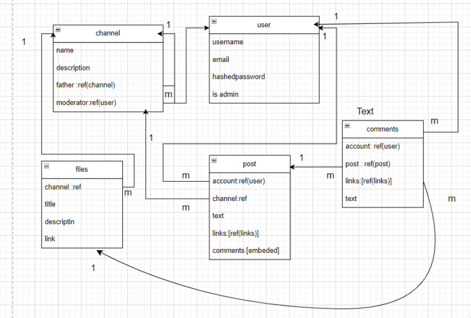

# UniClub Project

**Website:** [UniClub](https://uni-club-frontend.vercel.app/)
## App Description
UniClub Application is an app developed to allow the users to add channels for university courses, and add comments, posts, details related to each course in order to have a technical community in the university, that everyone can share their added comments, details, and posts with every student in the university.
- [trello](https://trello.com/invite/b/66d811064ce6804d91f53663/ATTIdeb4e6dfaebd8bdd53c86550a2466649F565403A/uniclub)
## User Stories:
- As a user, I should be able to sign in and sign up.
- As a user, I should be able to create channels, and be a moderator. 
- As a user, I should be able to post in each channel.
- As a user, I should be able to add comments in each channel.
- As a user, I should be able to add  files "notes, slides, books, past exams.. etc"
- As a user, I should be able to view all the added comments and details for each course.
- As a user, I should be able to edit and delete the comments and posts that I added.

## ERD:

## WireFrame:

- 

## Technologies Used

- React.js
- HTML
- CSS
- Express
- MongoDB
- npm

[Frond-end repo link](https://github.com/Fadelm300/UniClub-frontend.git)

